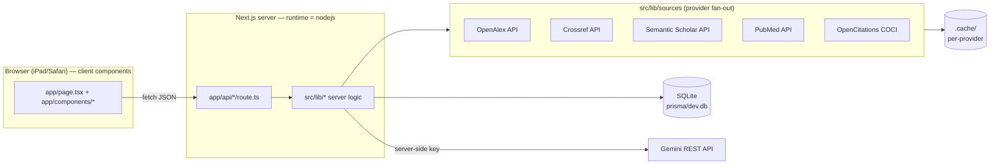

# ARCHITECTURE — So-study

**Status:** current as of 2026-08-18 (closes ROADMAP §7.6 items 13 and 18)
**Scope:** how the code is laid out, which module may import which, and the
invariants a change must not break. Product intent and phase status live in
[`ROADMAP.md`](ROADMAP.md); the rules this document enforces live in
[`rules/`](rules).

---

## 1. Runtime shape

One Next.js (App Router) process, one SQLite file, one external LLM.



Every route declares `runtime = "nodejs"` and `dynamic = "force-dynamic"`: they
touch Prisma and must not be statically optimised or edge-bundled.

**Secrets.** `GEMINI_API_KEY` is read in exactly one place, `src/lib/gemini.ts`
(server-only). `DATABASE_URL` is read by Prisma from `prisma/schema.prisma`. No
secret is ever prefixed `NEXT_PUBLIC_`, so none can reach the client bundle
(rules I10, E4).

---

## 2. The two library areas (`app/lib` vs `src/lib`)

Both exist on purpose. The split is by **who may load the module**, not by topic.

### `app/lib` — client-safe, pure, shared with the UI

| File | Contents |
| --- | --- |
| `types.ts` | The canonical wire/UI contracts (`ModuleDetail`, `MCQQuestion`, `AssessmentAttempt`, …). Both the API layer and the components speak these types |
| `study.ts` | Pure study helpers: `visibleTabIds()` (closed-book lock), `slugifyHeading()` (TOC/filename anchors) |
| `markdown.tsx` | The custom markdown renderer, including `[n]` citation buttons and heading anchor ids |
| `draftStore.ts` | Client-side essay-draft persistence — **client-safe** IndexedDB store with a `localStorage` fallback (no Node/Prisma/env) |

Rules for this directory: **no Node built-ins, no Prisma, no `process.env`, no
network.** Anything here can be imported by a client component *and* by server
code, so it must be safe in both.

### `src/lib` — server logic

| File | Contents |
| --- | --- |
| `prisma.ts` | The single `PrismaClient` (globally cached; hot-reload safe in dev). The only module allowed to construct it |
| `gemini.ts` | Gemini REST client, usage/cost estimation, `GeminiError`. The only reader of `GEMINI_API_KEY` |
| `guards.ts` | Input-length ceilings for the AI endpoints (§5) |
| `sources/types.ts` | Common `SourcePaper` shape + `SourceProvider` interface + `normalizeDoi` / `doiUrl` / `dedupeAndMerge` (dedupe by DOI, merge metadata, prefer Crossref for biblio) |
| `sources/openalex.ts` | `OpenAlexProvider` (refactor of the former `openalex.ts`) — on-disk `.cache/` per provider, degrades to `[]` on failure |
| `sources/crossref.ts` | `CrossrefProvider` (polite pool `mailto`); bibliographic fields win on merge |
| `sources/semanticscholar.ts` | `SemanticScholarProvider` (~1 req/s pacing) |
| `sources/pubmed.ts` | `PubMedProvider` |
| `sources/citations.ts` | `enrichCitations()` corroborates citation counts via OpenCitations COCI; Scite is an optional best-effort branch gated by `SCITE_API_KEY` (not required) |
| `sources/index.ts` | Aggregator `retrieveSources()` — `Promise.allSettled` fan-out with per-provider timeout, dedupe by DOI, COCI enrichment, central re-scoring via `scoring.ts`; throws only if ALL providers fail |
| `citation.ts` | `formatAPA()` — APA-7 reference rendering from a `SourcePaper` / `ExportPaper` |
| `scoring.ts` | Relevance heuristic + shortlist selection (citation floor, recency) |
| `topics.ts` | `ensureTopic()` — topic upsert used by the synthesis path |
| `aiusage.ts` | Writes the `AIUsage` cost row for every LLM call |
| `mcq.ts` | Deterministic cloze MCQ generation + `mcqHelpers` (chunking, claim extraction) |
| `scheduler.ts` | FSRS-derived spaced repetition: `review`, `isDue`, `outcomeToGrade`, `INITIAL_STATE` |
| `retrieval.ts` | Pure BM25-lite lexical ranker (`rankChunks`) used by `POST /api/qa` to pick top-k `ModuleChunk` |
| `metacog.ts` | The plan/monitor/evaluate prompt set (pure data) |
| `grounding.ts` | Post-generation faithfulness harness (`verifyGrounding`) — checks the synthesized module's citations against the approved source set to flag hallucinated/unsupported claims |
| `export.ts` | Markdown / Anki / PDF formatters for module export (pure) |

### Allowed import directions

```
app/components, app/page  ──►  app/lib                (always)
app/components            ──►  src/lib PURE modules   (metacog, and nothing that touches DB/env)
app/api/*/route.ts        ──►  src/lib, app/lib       (always)
src/lib                   ──►  app/lib               (types + pure helpers only)
src/lib                   ──►  app/components         NEVER
app/lib                   ──►  src/lib                NEVER
```

Concretely today: `src/lib/mcq.ts` imports `MCQQuestion` from `app/lib/types` (one
canonical type, not two), `src/lib/export.ts` imports `slugifyHeading` from
`app/lib/study` (one slug rule for anchors and filenames), and
`app/components/MetacogPanel.tsx` imports `METACOG_PROMPTS` from
`src/lib/metacog` — legal because that module is inert data with no DB or env
access.

**Test placement follows the same boundary:** `*.test.ts` next to the code it
tests (node environment), `*.dom.test.tsx` next to the component it renders
(jsdom environment). See §7.

---

## 3. Pipeline stages and where each lives

| Stage | Entry point | Server logic | Human gate |
| --- | --- | --- | --- |
| 1. Retrieve papers | `POST /api/retrieve` | `sources/index.ts` `retrieveSources()` → fans out to N providers (OpenAlex, Crossref, Semantic Scholar, PubMed) via `Promise.allSettled` with a per-provider timeout, **dedupes by DOI** (`dedupeAndMerge`, Crossref wins bibliographic fields), enriches citation counts via OpenCitations COCI (`citations.ts`), then **re-scores centrally** with `scoring.ts` (cached, no LLM) | — |
| 2. Approve papers | `PATCH /api/papers/[topicId]` | `prisma` (`TopicPaper.approved`) | **yes — required** |
| 3. Synthesize module | `POST /api/synthesize` | `gemini.ts`, `mcqHelpers`, `aiusage.ts`, `essay.ts` | blocked until approval |
| Essay retry | `POST /api/essay` | `essay.ts` (regenerates question only; rubric is harness) | — |
| 4. Read | `GET /api/modules/[id]` | `prisma` | — |
| 5. Ask (RAG) | `POST /api/qa` | `retrieval.ts` (`rankChunks`, BM25-lite) over stored `ModuleChunk` + `gemini.ts` | — |
| 6. Practise | `POST /api/mcq`, `/api/grade`, `/api/questions` | `mcq.ts`, `gemini.ts` | student authors cards |
| 7. Record + schedule | `POST /api/attempts` | `scheduler.ts` | — |
| 8. Review | `GET /api/attempts` | `scheduler.ts` (`isDue`) | — |
| 9. Export | `GET /api/modules/[id]/export` | `export.ts` (no LLM, no writes) | — |
| Cost | `GET /api/usage` | `aiusage.ts` | — |
| Progress | `GET /api/progress` | topic mastery + practice streak (reads FSRS `scheduledNextAt`) | — |
| Courses | `POST /api/courses` | `prisma` single upsert **or** batch `{names[], major?}` in one transaction (conflict → 409) | — |
| Reconcile | `GET`/`PUT /api/rps/[courseId]` | read snapshot + recompute diff (`rps.ts`); `PUT` stores `officialOrder`, aligns matched topics | — |
| Backup | `GET /api/backup` (full JSON snapshot), `POST /api/backup` (re-import; `confirm:"overwrite"`, zod-validated, transactional) | `prisma` | — |

Synthesis is the only stage that writes the module graph. It upserts
deduplicated `Paper` rows, links them via `TopicPaper`, writes/refreshes
`Module` + `ModuleChunk` + `Excerpt`, and **appends a `ModuleVersion`** rather
than blind-overwriting a regenerated module.

Retrieval now keys `Paper` rows on **DOI** (normalized via `normalizeDoi`):
the multi-provider fan-out (`src/lib/sources/`) dedupes and merges across
OpenAlex / Crossref / Semantic Scholar / PubMed so the same paper converges on
one row instead of appearing once per provider. `Paper` gained optional
bibliographic columns — `doi`, `venue`, `volume`, `issue`, `pages`,
`publisher`, `type`, `providers` (migration `add_paper_bibliography`) — and the
`ExportPaper` / `SourcePaper` DTOs carry the matching fields so `src/lib/citation.ts`
`formatAPA()` can render APA-7 references into both the Markdown and PDF exports.

### AI split in the practice pipeline (90% harness / 10% AI)
- **MCQ — 100% harness.** `src/lib/mcq.ts` builds cloze cards deterministically: the term
  pool is taken from `studyProse` (the trailing bibliography is dropped so author/journal
  names never become distractors), the masked term is salience-weighted (frequency + the
  module's "Konsep kunci" section), and distractors exclude morphological variants of the
  answer and prefer similar-length terms. No Gemini call.
- **Essay — ~90% harness / 10% AI.** The rubric is built by `buildEssayRubric` from the
  module's own structure (no LLM). Only the open-ended question still needs generation
  (`generateEssayPrompt`): a single, narrow call, `zod`-validated, retried once on malformed
  output, with every outcome logged (`kind:"essay"` / `kind:"essay_failed"`). A null result
  is persisted explicitly and the UI shows a retry (`POST /api/essay`) instead of a blank box.
- **Essay grading — AI** (legitimately open-ended; judges the answer against the harness rubric).

### Grounding chain

`Module.contentMarkdown` carries inline `[n]`; `Module.sourcePaperIds` is a JSON
array whose **order defines what `[n]` means**. `Excerpt` rows map each extracted
claim to `paperIds[n-1]`. Anything that renders or exports sources must preserve
that order — `GET /api/modules/[id]` and the Markdown export both re-sort fetched
papers back into `sourcePaperIds` order for exactly this reason.

---

## 4. Data model

Defined in [`../prisma/schema.prisma`](../prisma/schema.prisma). Shape:

```
Course ─┬─ Topic ─┬─ TopicPaper ── Paper ── Excerpt
         │         ├─ Module (1:1) ─┬─ ModuleChunk
         │         │                ├─ ModuleVersion
         │         │                ├─ Excerpt
         │         │                └─ CourseModule ── Course   (module ↔ many courses)
         │         ├─ QASession
         │         ├─ AssessmentAttempt   (practice log → spaced repetition)
         │         └─ QuestionBankItem    (author = "ai" | "student")
         └─ RPSReconcile (officialOrder snapshot; diff recomputed from Topic rows)
AIUsage                                   (cost, optionally per topic)
```

Notes that matter when changing code:

- SQLite has no array/JSON column type here: `Module.sourcePaperIds`,
  `ModuleChunk.embedding`, `QASession.messages` and `QuestionBankItem.options`
  are JSON **strings**. Always parse defensively — every current call site wraps
  `JSON.parse` in try/catch and degrades instead of throwing.
- `QuestionBankItem.author` is an authorisation boundary: `PATCH`/`DELETE` on
  `/api/questions` refuse anything not authored by `student` (403).
- `ModuleChunk.embedding` is the stub `"[]"` — Q&A now ranks chunks with the
  lexical BM25 ranker in `src/lib/retrieval.ts`, not embeddings.
- `Course.major` (`String?`) scopes OpenAlex retrieval and synthesis framing per
   discipline; sent as part of the OpenAlex `search` term so English-library results
   still surface for Indonesian course labels (it is **not** added to the relevance
   scoring terms, which would distort ranking on English abstracts).
- `Topic.orderSource` is used: the schema default is `"custom"`, and reconciling a
   course against its official RPS sets aligned topics to `"official_rps"`
   (`src/lib/rps.ts` `diffTopicOrder`); `app/page.tsx` shows an "unverified order"
   badge for anything not `"official_rps"`.
- `RPSReconcile` stores an `officialOrder` snapshot from the lecturer RPS and a
   `customOrder` snapshot of the student's topics. The diff is **not** persisted — it
   is recomputed from live `Topic` rows on every read so it cannot go stale.
- Deleting a `Module` cascades to its versions, chunks, excerpts and course
  links; deleting a `Topic` cascades to its papers/sessions/attempts.
- Schema changes require a migration + a `CHANGELOG.md` entry (rule I6).

---

## 5. Input-length guards

`src/lib/guards.ts` is the single table of ceilings for LLM-facing routes. Each
route validates **before** spending a Gemini call and returns
`413` with an actionable Indonesian message; input is never silently truncated,
because truncation drops the context a grounded answer depends on and hides cost.

| Route | Guarded |
| --- | --- |
| `POST /api/qa` | body bytes, `question`, chunk count, total chunk characters |
| `POST /api/grade` | body bytes, `studentAnswer`, `questionText`, `rubric` |
| `POST /api/mcq` | body bytes, `text` (bounds the deterministic fallback too, which scans the whole text) |
| `POST /api/synthesize` | body bytes, `title`, approved-paper count, assembled corpus |

The ceilings are abuse limits, not style limits: a real module (~16k characters)
and a long essay sit far inside them. `guards.test.ts` asserts that explicitly so
a future tightening cannot quietly break normal use.

---

## 6. Client-side state and offline behaviour

There is no global store; `app/page.tsx` owns course/module selection and passes
data down. Local persistence is intentional and narrow:

| Key | Written by | Why |
| --- | --- | --- |
| `draft:<topicId>` | `Workspace` essay box | never lose an essay draft on disconnect (R6) |
| `metacog:<topicTitle>` | `MetacogPanel` | reflections are private and device-local |
| `elaboration:<topicTitle>` | `ElaborationPanel` | elaboration/self-explanation notes are private and device-local |
| `onboarded` | `app/page.tsx` | first-run onboarding seen flag (written `"1"`) |

Offline rules: reading a module works; **Tanya and grading refuse with an
explicit "needs internet" message** rather than answering from nothing (R5), and
the MCQ auto-generation effect does not fire, so no call is attempted.

---

## 7. Tests and the gate

`vitest.config.mts` defines two projects so one command covers both worlds:

| Project | Environment | Includes | Setup |
| --- | --- | --- | --- |
| `node` | node | `src/**/*.test.ts`, `app/**/*.test.ts` | — |
| `dom` | jsdom | `app/**/*.dom.test.tsx` | `vitest.setup.ts` |

`vitest.setup.ts` registers jest-dom matchers, unmounts between tests, clears
`localStorage`, and stubs the two APIs jsdom has no layout engine for
(`scrollIntoView`, `print`). The `@` alias mirrors `tsconfig.json` so components
resolve imports exactly as in the Next build.

The DOM tests are written against **invariants, not markup**: closed-book hides
the reference tabs, offline never posts to `/api/qa` or `/api/grade`, grading an
MCQ posts an attempt, citations jump to the Sumber tab, export links point at the
export route, drafts survive a remount.

`scripts/ci.sh` (= `npm run ci`) is the gate: `prisma generate` → `eslint` →
`tsc --noEmit` → `vitest run`, failing at the first error.

---

## 8. Conventions

- TypeScript `strict`, no `any`. Components are PascalCase files under
  `app/components`; libraries are lowercase under `app/lib` / `src/lib`.
- Route handlers state their I/O contract in a header comment (method, params,
  status codes) — rule I3, no implicit behaviour.
- No empty `catch {}`. Either handle with a comment explaining the degradation,
  or surface the error to the UI (rule I9).
- Tailwind utility classes inline; the `print:` variant plus the `@media print`
  block in `app/globals.css` are the PDF path.
- UI copy is Indonesian and standardised on **Mata kuliah / Topik / Modul**.
  Programmer-facing 4xx messages may stay English; anything a student can trigger
  is Indonesian.

---

## 9. Known debt

Tracked with status in ROADMAP §6/§7.6; the architectural ones:

- **Service worker shipped** — `public/sw.js` + `app/components/ServiceWorkerRegister.tsx`
  provide a hand-rolled offline precache (see ROADMAP §6 / §15); "offline read" no
  longer depends on the browser cache alone.
- **`ModuleChunk.embedding` is `"[]"`**: the schema still reserves the column, but
  Q&A retrieval is lexical (BM25-lite in `src/lib/retrieval.ts`), not embeddings.
  A post-generation **faithfulness harness** (`src/lib/grounding.ts` `verifyGrounding`)
  nowFlags hallucinated/unsupported citations (ROADMAP §15, gap A).
- **Synthesis is SSE-streamed** — `streamGenerate` in `src/lib/gemini.ts` + the
  `text/event-stream` branch in `app/api/synthesize/route.ts`, with a non-streaming
  JSON fallback so the client still works behind a buffering proxy.
- **Essay drafts are in IndexedDB** — `app/lib/draftStore.ts` (client-safe, with a
  `localStorage` fallback), replacing the raw `localStorage` draft key.
- **Dashboard "ready"** means "a module exists *and* has been practised" (engagement-based,
  shipped in §13 WS7) — not merely "module exists".
