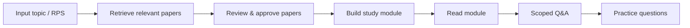

# Whitepaper — About (What the Application Is)

**Project:** `So-study` — Pre-Study Webapp for "Teori Antropologi Kontemporer"
**Version:** 1.0 (planning)
**Date:** 17 August 2026

---

## 1. The Problem We Want to Solve

A third-semester student typically meets the course material for the first time
during the live lecture. As a result, the first session with the lecturer is the
*first contact* with the theory — and the time is spent capturing basic concepts
rather than going deeper.

The simple question: **what if she already had a study handle before class**, so
that lecture time is used to deepen understanding rather than starting from zero?

---

## 2. This Is NOT "Stop Going to Campus"

Important: this application does **not** replace lectures. She still goes to
campus. The difference is that she arrives with an *early start* — having already
read a synthesis of the relevant theories from journals/papers, so that when the
lecturer explains, she already has a framework to connect the lecturer's points
to what she read at home.

All UI copy and framing must reinforce: this is a *head-start* tool, not a
substitute for the official course.

---

## 3. The Solution: A Per-Course Pre-Study Kit

The application assembles **self-study modules** from academic journals,
articles, and papers, then provides three things:

1. **Read** — a coherent written module (not just a raw PDF).
2. **Ask** — a Q&A session that answers *only* from the module content (safe
   from hallucinated theory outside the sources).
3. **Test** — multiple-choice questions plus an essay with rubric-based feedback.

All of it is organized **per topic / per week** so it aligns with the lecture
schedule.

---

## 4. Who the User Is

- **One person** (a student, the end user — not a developer).
- Uses an **iPad + Magic Keyboard**, opened through Safari.
- No heavy installs needed — just "Add to Home Screen" (PWA).

---

## 5. How It Works (4 Stages)

1. **Input topics** — the topic order is entered by a human (from the official
   RPS if available, or a curated list if not). If it is not from the official
   RPS, it is flagged in red as a *custom sequence* so she knows to reconcile it
   later.
2. **Retrieve papers** — the system finds academic papers using a *heuristic*
   method (keywords + citation count + year), not an AI guess.
3. **Approve papers** — a human chooses which papers to use before proceeding.
   This is a safety gate so the module does not go off-track from the start.
4. **Module + Ask + Test** — the AI builds the module from the approved papers,
   then the student reads, asks (only from the module), and does the practice.

---

## 6. Academic Safety (Anti-Hallucination)

Two guarding principles:

- **Every claim has a source.** The module always lists the original papers used.
  No statement without a reference.
- **Q&A is bounded.** The AI may only answer from the module content + source
  papers. If a question is outside that, the AI must say "not in the material"
  — not fill in from general knowledge that could be wrong.

This matters because misunderstanding a concept early actually makes the lecture
more confusing, not easier.

---

## 7. Access on the iPad

- **PWA**: can be installed on the home screen and feels like a native app
  (fullscreen, own icon).
- **Offline**: modules can be read without internet. Q&A and essay grading need
  internet — and the app will say "connect to the internet" rather than give a
  fake answer.
- **Auto-saved**: all progress auto-saves; essay drafts stay safe even if the
  connection drops while typing.

---

## 8. Cost

- Development & infrastructure: **$0** (free Vercel Hobby + free Turso + free
  OpenAlex).
- The only running cost: **Gemini API usage** (to build modules, run Q&A, and
  grade essays). This is not a development cost but a per-use running cost — the
  core of the app's value.

---

## 9. Non-Goals (What Is NOT Included)

- Not a multi-user application / scaled product.
- Not a general research assistant / broad literature-review tool.
- Not a native iOS app (PWA is sufficient).
- Not a replacement for lectures.

---

## 10. Value Summary

The student arrives at the lecture **better prepared**, with study material she
has already read and understood on her own at home — so the face-to-face session
is used to go deeper, not to start from zero.
