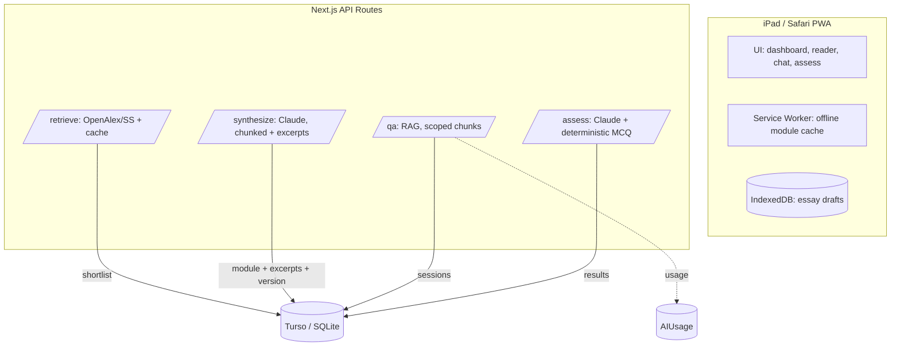

# Whitepaper — Technical

**Project:** `So-study` — Pre-Study Webapp
**Version:** 2.0 (planning — pre-execution improvements folded in)
**Date:** 2026-08-17

---

## 1. System Overview

A single-user, local-first Next.js web app that converts academic papers into
structured study modules for one or more courses, then provides scoped Q&A and
assessment. The architecture deliberately separates **retrieval** (deterministic,
cheap) from **generation** (LLM, bounded), and **grounds** every generated output
to its source papers — at the level of individual excerpts, not just paper IDs —
to prevent hallucinated theory.



---

## 2. Tech Stack & Rationale

| Layer | Choice | Why |
| --- | --- | --- |
| Framework | Next.js App Router + TS + Tailwind | One codebase; Vercel-native zero-config deploy |
| DB | Turso (libSQL/SQLite-compatible, hosted) | Vercel serverless is ephemeral → file SQLite won't persist; Turso free tier generous |
| LLM | Google Gemini API; optional Ollama for routine Q&A | Synthesis/grading on Gemini; cheap/private local Q&A |
| Q&A method | Retrieval-augmented (embed module chunks, retrieve 3–5, inject only those) | Grounded + far cheaper than full-module injection |
| Retrieval | OpenAlex (primary, keyless) + Semantic Scholar (fallback); responses cached | Heuristic metadata filtering, not generation |
| Embeddings | Local or hosted embedding model for module chunks | Powers RAG retrieval |
| Deploy | Vercel Hobby (free) | No Cloudflare adapter friction |
| Auth | None + optional hardcoded passphrase | Single user, zero friction |
| CI | Lint + typecheck + unit tests (incl. retrieval scoring) in Phase 0 | Required by rule sets (E3/G10) |

**Cost model:** $0 dev/infra. Only Gemini API is a per-use running cost, made
visible via the `AIUsage` dashboard panel.

---

## 3. Data Model (Prisma / Turso) — v2

```prisma
model Course {
  id     String  @id @default(cuid())
  name   String
  topics Topic[]
}

model Topic {
  id          String  @id @default(cuid())
  courseId    String
  course      Course  @relation(fields: [courseId], references: [id])
  title       String
  weekNumber  Int?
  orderSource String   // "official_rps" | "custom"
  status      String   // pending | papers_fetched | module_generated | ready
  topicPapers TopicPaper[]
  module      Module?
  moduleVersions ModuleVersion[]
  qaSessions  QASession[]
  assessments Assessment[]
  reconciles  RPSReconcile[]
}

model Paper {
  id                String  @id @default(cuid())
  title             String
  authors           String
  year              Int
  abstract          String
  sourceUrl         String
  citationCount     Int
  relevanceScore    Float
  fullTextAvailable Boolean
  topicPapers       TopicPaper[]   // shared & deduplicated across topics
}

model TopicPaper {                 // many-to-many join
  topicId   String
  paperId   String
  approved  Boolean  @default(false)
  addedAt   DateTime @default(now())
  topic     Topic   @relation(fields: [topicId], references: [id])
  paper     Paper   @relation(fields: [paperId], references: [id])
  @@id([topicId, paperId])
}

model Module {
  id              String   @id @default(cuid())
  topicId         String   @unique
  topic           Topic    @relation(fields: [topicId], references: [id])
  contentMarkdown String
  generatedAt     DateTime @default(now())
  sourcePaperIds  String   // JSON array, for traceability/grounding
  excerpts        Excerpt[]
  versions        ModuleVersion[]
  chunks          ModuleChunk[]   // for RAG retrieval
}

model ModuleChunk {               // embedding-backed RAG units
  id         String @id @default(cuid())
  moduleId   String
  module     Module @relation(fields: [moduleId], references: [id])
  chunkIndex Int
  text       String
  embedding  String  // JSON vector
}

model Excerpt {                   // claim -> excerpt -> paper grounding
  id        String @id @default(cuid())
  moduleId  String
  paperId   String
  claim     String  // the synthesized statement
  quote     String  // verbatim span from the source
  location  String  // section/page anchor
}

model ModuleVersion {             // regenerate = new version, never overwrite
  id              String   @id @default(cuid())
  moduleId        String
  module          Module    @relation(fields: [moduleId], references: [id])
  version         Int
  contentMarkdown String
  generatedAt     DateTime @default(now())
  changeNote      String?
}

model QASession {
  id              String   @id @default(cuid())
  topicId         String
  topic           Topic    @relation(fields: [topicId], references: [id])
  messages        String   // JSON {role, content, timestamp, retrievedChunkIds?}
}

model Assessment {
  id            String   @id @default(cuid())
  topicId       String
  topic         Topic    @relation(fields: [topicId], references: [id])
  questionType  String   // "mcq" | "essay"
  questionText  String
  studentAnswer String?
  rubric        String?  // explicit grading rubric (stored, visible)
  aiFeedback    String?
  score         Float?   // null for qualitative essay
  grounded      Boolean? // feedback cites module sections?
}

model RPSReconcile {              // diff custom vs official order (R1)
  id            String @id @default(cuid())
  courseId      String
  officialOrder String // JSON array of topic titles in official order
  customOrder   String // JSON array of the student's custom order
  diff          String // JSON of mismatches
}

model AIUsage {                   // cost observability
  id          String   @id @default(cuid())
  topicId     String?
  kind        String   // "synthesize" | "qa" | "grade"
  tokensIn    Int
  tokensOut   Int
  estimatedCost Float
  createdAt   DateTime @default(now())
}
```

---

## 4. Pipeline Stages

### Stage 1 — Retrieval (heuristic, no LLM, cached)
For each Topic:
1. Query OpenAlex with topic title + 2–3 related keywords. **Cache the raw
   response** (Turso or local) so re-runs don't repeat calls / hit rate limits.
2. Filter: `year >= 1970` (allow older foundational if historical), citation
   count threshold = `max(2, top quartile of that query's results)` (subfield-
   relative, with an absolute floor), prefer `is_oa = true`. Fall back to recency
   when citations are sparse.
3. Score relevance heuristically (keyword overlap / TF-IDF). **No LLM call.**
4. Upsert into shared `Paper`; link via `TopicPaper` (deduplicated across topics).
5. **Surface shortlist for human approval** (`approved=false` until ticked) —
   never auto-approve.

### Stage 2 — Synthesis (LLM, bounded, versioned, excerpted)
1. Per approved paper: if full text available, chunk by section → generate
   per-paper summary first (concept, core argument, method). Tokens bounded.
2. Combine into one synthesis call with **fixed structure**:
   - Konsep kunci & definisi
   - Argumen utama tiap sumber (with paper attribution)
   - Perbandingan/kontras antar teori (if relevant)
   - Ringkasan & relevansi untuk topik minggu ini
3. **Extract `Excerpt` rows** (claim → verbatim quote → paper + location) so every
   statement is traceable to a source span.
4. Split module into `ModuleChunk` rows and compute embeddings for RAG.
5. Persist as `Module` + first `ModuleVersion` (version 1). Log `AIUsage`.

### Stage 3 — Scoped Q&A (retrieval-augmented, not full injection)
- Chat scoped per Topic/Module.
- **RAG flow:** embed the user question → retrieve the 3–5 most relevant
  `ModuleChunk`s → inject only those (plus the locked system prompt) into the
  Claude call. This keeps token cost low and grounding tight.
- System prompt locked: *Answer only from the provided module excerpts/chunks and
  their source papers. If the question exceeds these sources, say so explicitly.*
- Each answer stores `retrievedChunkIds` for traceability. Stream the response
  (SSE) to avoid "hung" perception.

### Stage 4 — Assessment
- 3–5 MCQ (deterministic exact-match grading, **no API**) + 1–2 essay prompts.
- Essay graded by LLM with an explicit, **stored `rubric`** grounded in module
  content; sets `grounded` flag; outputs **qualitative feedback**, not just a number.
- Log `AIUsage`.

---

## 5. Grounding & Safety Mechanisms

- **Excerpt-level grounding:** every Module ends with a `Sources` block; each
  claim can be expanded to its `Excerpt` (quote + paper + location). No source →
  no claim.
- **Locked, RAG-scoped Q&A:** model cannot answer from outside retrieved chunks.
- **Human-in-the-loop gates:** (a) topic order human-input, flagged `custom` if
  not from official RPS; (b) `TopicPaper.approved` required before synthesis;
  (c) **RPS reconcile/diff view** lets her align custom order to the real syllabus.
- **No offline fabrication:** Q&A/grading require network; UI shows explicit
  "connect" state instead of a fake answer.
- **Optional local LLM:** routine Q&A can run on Ollama (Phase 3) for $0 marginal
  cost and privacy, while synthesis/grading stay on Claude.

---

## 6. API Integrations

- **OpenAlex**: `GET /works?search=...&filter=...&sort=...` — no key, stable,
  rich metadata. Responses cached.
- **Semantic Scholar**: fallback for coverage; rate-limited.
- **Gemini**: `generateContent` API (streaming) with system prompt; chunked inputs;
  modules cached permanently (never regenerate unless forced → new `ModuleVersion`).
- **Embeddings**: model of choice for `ModuleChunk` vectors (local or hosted).

---

## 7. Deployment, Offline & Cost Observability

- **Local-first dev**: run on dev machine; student accesses via LAN IP on iPad.
- **Deploy**: Vercel Hobby; Turso prod DB via env `DATABASE_URL`.
- **Offline**: PWA service worker caches module HTML/markdown. Q&A + grading are
  network-only and fail visibly.
- **Draft safety**: essay text persisted to IndexedDB before submit.
- **Cost observability**: every Gemini call writes an `AIUsage` row
  (kind, tokensIn, tokensOut, estimatedCost). Dashboard shows per-topic and
  total running cost so the paid portion is never a mystery.

---

## 8. Security & Privacy

- Single user → no multi-tenant auth complexity.
- **Gemini key strictly server-side** in API routes; never in client bundles.
- Secrets via env only (`GEMINI_API_KEY`, `DATABASE_URL`); never logged.
- Pinned dependency versions (lockfile); lint + typecheck + tests must pass
  before any run (rule E3).
- Minimal data: only the study content the user herself provides/curates.

---

## 9. Pre-Execution Improvements (incorporated)

- Deeper grounding via `Excerpt` (claim→quote→paper).
- Robust citation floor `max(2, top-quartile)` + recency fallback.
- Shared/deduplicated `Paper` via `TopicPaper` many-to-many.
- `RPSReconcile` diff view (mitigates R1) — prioritized above snapshots.
- `ModuleVersion` for regenerate diffs (no blind overwrite).
- RAG Q&A instead of full-module injection; SSE streaming.
- OpenAlex response caching; server-side key; `AIUsage` cost panel.
- Tests + CI gate in Phase 0 (rule E3/G10).
- Post-MVP: SM-2 spaced repetition, Ollama toggle, export PDF/MD/Anki, habit loop,
  multi-course from the start.

---

## 10. Limits & Future Work

- v1: single student, manual topic input, no snapshot system (deferred to Phase 3).
- Deferred: snapshot/checkpoint versioning, native app (rejected — PWA sufficient).
- Scaling beyond 1 user would require auth, rate limiting, and quota management —
  out of scope by design.
